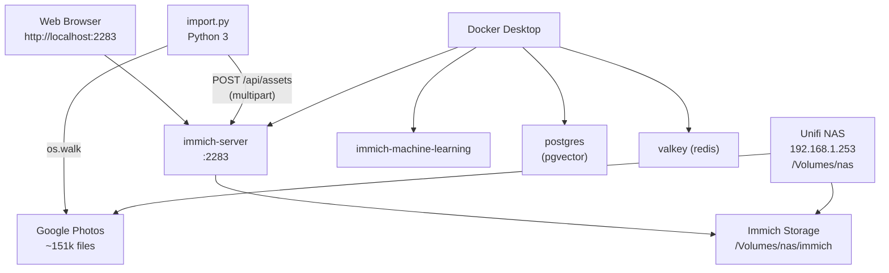
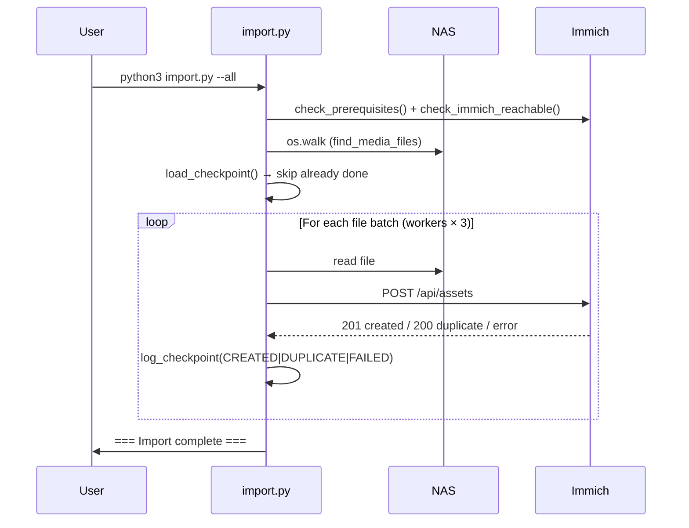
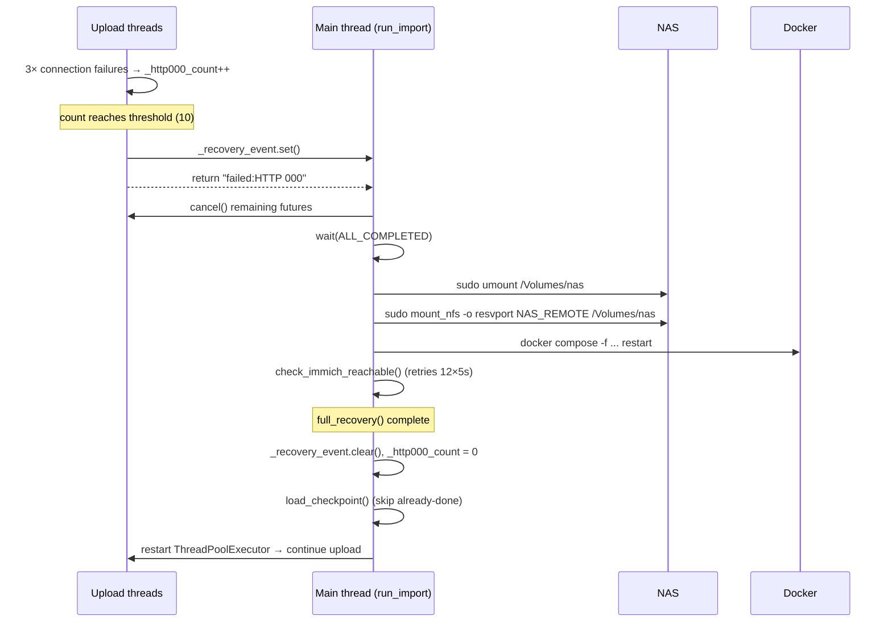

# Immich Self-Hosted Photo Library — System Documentation

This document captures the full context, requirements, design decisions, and operational details
needed to rebuild this system from scratch.

---

## 1. Context

The owner has a lifetime Google Photos archive of ~151,801 media files (~1 TB) exported via
Google Takeout. The goal is to migrate this library off Google Photos into a fully self-hosted,
privately controlled photo management system running on local hardware.

The archive lives on a Unifi NAS on the home network. Immich is deployed locally on a MacBook
Pro and stores its data back to the same NAS. Once the import is complete, Immich becomes the
permanent home for the photo library.

---

## 2. Hardware

### Workstation (Immich host)
| Property | Value |
|---|---|
| Model | MacBook Pro 18,1 |
| Chip | Apple M1 Pro |
| CPU cores | 10 (8 performance + 2 efficiency) |
| RAM | 32 GB |
| OS | macOS 26.3 (Darwin 25.3.0) |
| Shell | zsh (bash 3.2 for scripts) |

### NAS
| Property | Value |
|---|---|
| Vendor | Unifi |
| IP | 192.168.1.253 |
| Protocol | NFS v3 |
| NFS export | `/volume/4f4177a8-2edb-471a-a967-45430316197c/.srv/.unifi-drive/drive/.data` |
| macOS mount point | `/Volumes/nas` |
| Mount options | `resvport` (required for macOS NFS) |
| Photos path | `/Volumes/nas/Google Photos/Radu` |
| Immich storage path | `/Volumes/nas/immich` |

---

## 3. Technology Choices

### Immich
- **What**: Open-source self-hosted photo and video management platform.
- **Why**: Feature-complete Google Photos alternative (albums, face recognition, timeline,
  mobile apps, sharing). Active development. Docker-native.
- **Version**: `v2` (latest release tag)
- **Source**: Official Docker Compose from `https://github.com/immich-app/immich/releases/latest/download/docker-compose.yml`

### Docker Desktop for Mac
- **What**: Container runtime for macOS.
- **Why**: Required to run Immich's multi-container stack on macOS.
- **Filesystem bridge**: VirtioFS (Docker Desktop's macOS filesystem event service).
- **Known limitation**: VirtioFS can crash (`service fs failed: injecting event blocked for 60s`)
  under heavy concurrent NFS I/O. Mitigated by capping parallel uploads at 3.
- **Resource allocation**: 10 CPUs, 7.65 GB RAM (configured in Docker Desktop settings).

### Docker Compose services
| Container | Image | Role |
|---|---|---|
| `immich_server` | `ghcr.io/immich-app/immich-server:v2` | API server, asset ingestion, thumbnail generation |
| `immich_machine_learning` | `ghcr.io/immich-app/immich-machine-learning:v2` | Face recognition, CLIP embeddings |
| `immich_postgres` | `ghcr.io/immich-app/postgres:14-vectorchord0.4.3` | Primary database with pgvector extension |
| `immich_redis` | `docker.io/valkey/valkey:9` | Job queue and cache |

### Container resource limits (docker-compose.override.yml)
| Container | CPU limit | RAM limit | CPU reservation | RAM reservation |
|---|---|---|---|---|
| `immich-server` | 6 cores | 3 GB | 4 cores | 2 GB |
| `immich-machine-learning` | 4 cores | 3 GB | 2 cores | 2 GB |
| `database` | 2 cores | 1 GB | 1 core | 512 MB |

### Bash scripts
All automation is written in **bash 3.2** (macOS default) for maximum compatibility.
No bash 4+ features (`declare -A`, `${var,,}`, `mktemp` with non-trailing suffixes).
Python 3 is used inline for tasks bash cannot handle cleanly:
- JSON sidecar parsing (Google Takeout `photoTakenTime`)
- O(n+m) checkpoint set filtering

---

## 4. Repository Layout

```
immich-test/
├── output/
│   ├── install.sh              # Downloads and configures Immich
│   ├── start.sh                # Starts Docker Compose stack
│   ├── stop.sh                 # Stops Docker Compose stack
│   ├── reset.sh                # Wipes all Immich data for a clean start
│   ├── mount.sh                # Mounts the NAS via NFS (requires sudo)
│   ├── import.py               # Imports Google Photos Takeout into Immich
│   ├── import.log              # Persistent import log (checkpoint source)
│   └── install/
│       ├── docker-compose.yml          # Official Immich compose (do not edit)
│       ├── docker-compose.override.yml # Local overrides: volumes + resource limits
│       ├── .env                        # Immich configuration (paths, DB credentials)
│       └── postgres/                   # Postgres data directory
└── tests/
    ├── run_tests.sh            # Runs full BATS + pytest test suite
    ├── test_install.bats
    ├── test_start.bats
    ├── test_stop.bats
    ├── test_reset.bats
    ├── test_import.py          # pytest tests for import.py (20 cases, no live server)
    └── helpers/
        └── common.bash         # Shared test helpers and mock binaries
```

---

## 5. Functional Requirements

### FR-1: NAS mounting
- Mount the Unifi NAS over NFS at `/Volumes/nas`.
- Auto-escalate to root via `exec sudo "$0" "$@"` if not already root.
- Verify the NAS is reachable by ping before attempting mount.
- Detect if this machine's IP is not in the NAS NFS whitelist and surface a
  specific actionable error (add IP in Unifi NAS admin UI).
- Skip mount if already mounted.

### FR-2: Immich installation
- Download `docker-compose.yml` and `example.env` from the official Immich GitHub release.
- Write `.env` with:
  - `UPLOAD_LOCATION=/Volumes/nas/immich`
  - `DB_DATA_LOCATION=<install_dir>/postgres`
- Write `docker-compose.override.yml` with:
  - Read-only NAS Google Photos volume mount into `immich-server`
  - Per-container CPU and memory resource limits
- All paths overridable via environment variables for testability.

### FR-3: Start / stop
- `start.sh`: verify Docker installed → daemon running → compose file exists → `docker compose up -d`
- `stop.sh`: same checks → `docker compose down`
- Both scripts print clear error messages for each failure mode.

### FR-6: Reset
- `reset.sh`: wipe all Immich-managed data to start fresh.
- Deletes: NAS Immich storage directory (`IMMICH_STORAGE_DIR`), Postgres data directory
  (`<install_dir>/postgres`), and truncates `import.log` (checkpoint).
- Preserves: `.env`, compose files, and the Google Photos source directory on the NAS.
- Requires `--confirm` flag or interactive "yes" prompt to prevent accidental data loss.
- All paths overridable via environment variables for testability.

### FR-4: Photo import
- Import all media files from `/Volumes/nas/Google Photos/Radu` into Immich via its REST API.
- Implemented as a single pure-Python script (`output/import.py`) — no bash subprocess spawns.
- Support `--test` mode (5 files) and `--all` mode (full library).
- Detect correct file creation date from Google Takeout JSON sidecars (`photoTakenTime`),
  falling back to file mtime.
- Track import progress in `import.log`. Resume after crash: skip already-processed files.
- Show live progress: files processed, files/min, elapsed time every 50 files.
- Support configurable parallel uploads (`IMMICH_PARALLEL`, default 14).
- Skip files larger than `IMMICH_LARGE_MB` (default 99 MB) to protect Docker Desktop's
  VirtioFS from I/O saturation.

### FR-5: Automated tests
- All scripts must have repeatable BATS tests.
- Tests must not require network, Docker daemon, or NAS — all external calls mocked.
- Tests cover: missing prerequisites, daemon not running, download failures, config content,
  docker compose failures.

---

## 6. Non-Functional Requirements

### NFR-1: Resilience
- Import is safe to re-run after crash or interruption.
- Checkpoint is derived from `import.log` — no separate state file that can get out of sync.
- Checkpoint uses O(n+m) Python set filter: loads done-set once, streams find output — avoids
  re-reading all 151k NAS file paths for each lookup.
- **In-process self-healing**: when 10 consecutive HTTP 000 connection failures accumulate,
  `import.py` stops all upload threads, runs `full_recovery()` (umount → mount_nfs → docker
  compose restart → wait for Immich healthy), then continues from checkpoint automatically.
  No external cron or human intervention required.

### NFR-2: macOS bash 3.2 compatibility
- No `declare -A` (associative arrays — bash 4+ only).
- No `${var,,}` or `${var^^}` (case conversion — bash 4+ only).
- `mktemp` suffixes must be trailing Xs only (BSD mktemp constraint).
- Uses `tr '[:upper:]' '[:lower:]'` for case conversion.

### NFR-3: NAS protection
- Never more than 3 concurrent NFS reads (controlled by `IMMICH_PARALLEL`).
- Files >99 MB are skipped to prevent large sequential reads from saturating the NFS connection.
- NAS reachability checked every 50 files during import.
- Background `find` processes are killed on script exit via `trap cleanup EXIT`.

### NFR-4: Docker Desktop stability
- Parallel uploads capped at 3 to prevent VirtioFS filesystem event queue overflow.
- `check_immich_reachable` retries for up to 60 seconds after Docker restart before
  starting uploads, avoiding HTTP 000 failures on cold start.

### NFR-5: Performance
- Pure-Python streaming pipeline (`import.py`): no per-file subprocess spawns (no bash/curl/python3
  child processes), no TCP handshake overhead (thread-local persistent `HTTPConnection`).
- Streaming generator pipeline: `find_media_files → checkpoint filter → prechecker → ThreadPoolExecutor`;
  uploads start as soon as the first 50-file prechecker batch completes (~10 s).
- MIME type detection is purely extension-based (no `file --mime-type` subprocess per file).
- Test mode skips checkpoint filter and prechecker entirely — Immich's `deviceAssetId`-based
  deduplication handles already-uploaded files natively, avoiding a slow NFS scan on short runs.
- Prechecker SHA1-hashes files in parallel (6 threads via `ThreadPoolExecutor`) and uses small
  batches (default 50) so the first uploads start within ~10 sec of launch.

### NFR-6: Observability
- All script output uses prefixed log levels: `[INFO]`, `[OK]`, `[SKIP]`, `[WARN]`, `[ERROR]`, `[PROGRESS]`.
- Every upload outcome written to `output/import.log` with UTC timestamp and status token:
  `CREATED`, `DUPLICATE`, `FAILED`.
- Operational log at `logs/import.log` — cleared on each start, receives all INFO/WARN/ERROR output.
- Progress line printed every 50 files: `processed | imported | dupes | failed | files/min | elapsed`.

---

## 7. System Diagrams

### System Overview



### Normal Import Flow



### In-Process Recovery Flow (HTTP 000)



## 8. Import Pipeline

```
find_media_files()               os.walk generator, ext filter + size < LARGE_FILE_MB
        │
        ▼
checkpoint filter                in-line: skips relative paths already in import.log
        │
        ▼
prechecker()                     generator: batch 50 paths → parallel SHA1 (6 threads)
        │                        → POST /api/assets/bulk-upload-check → yield only new paths
        ▼
ThreadPoolExecutor(MAX_PARALLEL) submit upload() as each path arrives from generator
        │
        ▼
as_completed()                   process results as they finish
        │
        ├── created   → [OK]    + log CREATED   → output/import.log
        ├── duplicate → [SKIP]  + log DUPLICATE → output/import.log
        └── failed:*  → [WARN]  + log FAILED    → output/import.log
```

Each `upload()` call (runs in thread pool):
1. Derives MIME type from file extension (in-process, no subprocess)
2. Reads `photoTakenTime` from `.json` sidecar if present, else uses `os.stat` mtime
3. Builds multipart/form-data body in-memory
4. POSTs via thread-local persistent `HTTPConnection` (no TCP handshake per file)
5. Retries up to 3× on connection error, reconnecting each time

**--test mode**: skips checkpoint filter and prechecker; takes first `TEST_COUNT` paths
directly from `find_media_files()`. Immich native dedup handles already-uploaded files.

---

## 9. Google Takeout Structure

```
/Volumes/nas/Google Photos/Radu/
└── takeout-20250119T102838Z-001/
    └── Takeout/
        └── Google Photos/
            ├── Photos from 2020/
            │   ├── IMG_1234.jpg
            │   └── IMG_1234.jpg.json    ← sidecar with photoTakenTime
            ├── Family & friends/
            └── ...
└── takeout-20250119T102838Z-002/
└── ...  (5 takeout archives total)
```

The JSON sidecar structure:
```json
{
  "photoTakenTime": { "timestamp": "1587300000", "formatted": "..." },
  "creationTime":   { "timestamp": "1587300001", "formatted": "..." }
}
```
`photoTakenTime` is preferred; `creationTime` is the fallback.

---

## 10. Edge Cases and Known Issues

| Issue | Root cause | Mitigation |
|---|---|---|
| Docker Desktop crash (`service fs failed: injecting event blocked for 60s`) | VirtioFS filesystem event queue saturated by concurrent NFS writes through Docker bind mount | Cap parallel uploads at 3; skip files >99 MB |
| NAS "Permission denied" on NFS mount | This machine's IP not in Unifi NAS NFS whitelist | `mount.sh` runs `showmount -e` to detect and surfaces actionable error message |
| Import hangs at startup | Stale `find` processes from killed runs still scanning NFS, consuming all bandwidth | `trap cleanup EXIT` kills all background jobs; `pkill -f "find /Volumes/nas"` to manually clear |
| HTTP 000 failures on cold start | Immich not fully initialised after Docker restart despite responding to ping | `check_immich_reachable` retries every 5s for up to 60s |
| Persistent HTTP 000 stalls mid-run | NAS drops NFS connection / Docker VirtioFS crash | In-process recovery loop: 10 failures → `full_recovery()` → remount NAS + restart Docker + wait healthy → continue from checkpoint |
| `mktemp` fails with suffix | BSD `mktemp` requires Xs at end of template only | All `mktemp` calls use trailing-X-only templates |
| `${var,,}` bad substitution | bash 3.2 does not support case conversion syntax | Replaced with `tr '[:upper:]' '[:lower:]'` |
| Python `BrokenPipeError` noise | `head -N` closes pipe before python filter finishes | `2>/dev/null` on python3 filter call |
| Test mode hangs | Checkpoint filter streams all 151k NAS paths before finding N new files | Test mode bypasses checkpoint filter; uses Immich native dedup |
| Large video files causing HTTP 100 | Immich returning `100 Continue` on oversized uploads before timing out | Skip files >99 MB |
| Files with spaces in path | Shell word splitting breaks `xargs` argument passing | `xargs -I {}` replaces at argument level, not via shell — spaces are safe |

---

## 11. Configuration Reference

### Environment variables — import.py
| Variable | Default | Description |
|---|---|---|
| `IMMICH_API_KEY` | *(required)* | Immich API key (Account Settings → API Keys) |
| `IMMICH_URL` | `http://localhost:2283` | Immich base URL |
| `IMMICH_PHOTOS_DIR` | `/Volumes/nas/Google Photos/Radu` | Source photo directory |
| `IMMICH_PARALLEL` | `6` | Concurrent uploads |
| `IMMICH_LARGE_MB` | `99` | Files above this size (MB) are skipped |
| `IMMICH_TEST_COUNT` | `5` | Number of files for `--test` mode |
| `PRECHECKER_BATCH_SIZE` | `50` | Files per bulk-upload-check batch (SHA1 hashed in parallel with 6 threads) |

### Environment variables — install.sh
| Variable | Default | Description |
|---|---|---|
| `IMMICH_INSTALL_DIR` | `<script_dir>/install` | Where compose files are written |
| `IMMICH_NAS_MOUNT` | `/Volumes/nas` | NAS mount point |
| `IMMICH_DOCKER_COMPOSE_URL` | GitHub latest release URL | Compose file source |
| `DOCKER_CMD` | `docker` | Docker binary (override for tests) |

### .env (Immich configuration)
| Key | Value |
|---|---|
| `UPLOAD_LOCATION` | `/Volumes/nas/immich` |
| `DB_DATA_LOCATION` | `<install_dir>/postgres` |
| `IMMICH_VERSION` | `v2` |
| `DB_PASSWORD` | `postgres` |
| `DB_USERNAME` | `postgres` |
| `DB_DATABASE_NAME` | `immich` |

---

## 12. Rebuild Procedure

### Prerequisites
- macOS with Docker Desktop installed and running
- Homebrew (`brew`) for `bats-core` (tests only)
- NAS mounted or mountable at `192.168.1.253`
- This machine's IP in the Unifi NAS NFS allowed clients list

### Step 1 — Mount the NAS
```bash
sudo ./output/mount.sh
```

### Step 2 — Install Immich
```bash
./output/install.sh
```

### Step 3 — Start Immich
```bash
./output/start.sh
# Wait ~30s for all containers to reach healthy state
# Web UI: http://localhost:2283
```

### Step 4 — Get an API key
1. Open `http://localhost:2283`
2. Create an admin account
3. Account Settings → API Keys → New API Key

### Step 5 — Run test import (verify setup)
```bash
IMMICH_API_KEY=<key> python3 output/import.py --test
```

### Step 6 — Run full import
```bash
IMMICH_API_KEY=<key> python3 output/import.py --all
# Safe to kill and re-run — resumes from checkpoint
# Operational log: logs/import.log (cleared each run)
# Checkpoint log:  output/import.log (persistent)
```

### Step 6a — Reset everything (optional)
To wipe all uploaded data and start over (e.g. after a misconfiguration or test run):
```bash
./output/reset.sh           # interactive prompt
./output/reset.sh --confirm # non-interactive (scripted use)
```
This deletes the NAS Immich storage, the Postgres data directory, and clears `import.log`.
Config files (`.env`, compose files) are preserved. Run `./output/start.sh` afterwards
to bring up a clean empty instance.

### Step 7 — Run tests
```bash
./tests/run_tests.sh
```

---

## 13. Import Progress (as of 2026-03-14)

| Metric | Count |
|---|---|
| Total files in library | ~151,801 |
| Successfully imported (CREATED) | ~30,403 |
| Duplicates (already in Immich) | ~4,531 |
| Failed (to be retried) | ~1,195 |
| Remaining | ~121,000 |
| Files skipped (>99 MB) | not yet counted |
